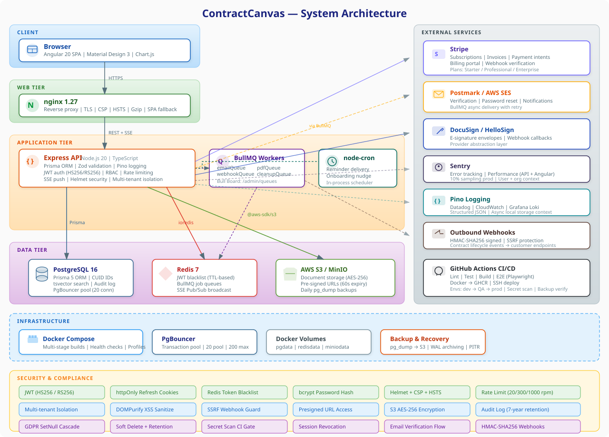

# ContractCanvas

ContractCanvas is a multi-tenant contract lifecycle management (CLM) platform for law firms and legal teams.

## Architecture



## Tech Stack

- **Runtime**: Node.js 20, TypeScript (strict mode), ESM
- **API**: Express 4, Zod validation, Pino structured logging
- **ORM / DB**: Prisma 5, PostgreSQL 16
- **Frontend**: Angular 19 (standalone components), Angular Material (Material Design 3)
- **Auth**: jose (HS256 / RS256 JWT), httpOnly refresh cookies, Redis token blacklist
- **Storage**: AWS S3 / MinIO (pre-signed URLs, sizeBytes tracking)
- **Payments**: Stripe (subscriptions, webhooks, billing portal)
- **Notifications**: Server-Sent Events (in-process SSE registry)
- **Background tasks**: node-cron (reminders); BullMQ planned for email / PDF / webhook queues
- **Error tracking**: Sentry (API + Angular)
- **Infrastructure**: Docker Compose, multi-stage Dockerfile

## Prerequisites

- Node.js >= 20
- Docker and Docker Compose
- Git

## Quick Start

### 1. Clone the repository and install dependencies

```bash
git clone <repo-url> contractcanvas
cd contractcanvas
npm install
```

### 2. Create your environment file

An `infra/.env.example` file must be created (see [Environment Variables](#environment-variables) below for the full list). Copy it:

```bash
cp infra/.env.example infra/.env
```

Edit `infra/.env` and fill in all required values before continuing.

### 3. Start the backing services

```bash
docker compose -f infra/docker-compose.yml up -d db minio redis
```

This starts PostgreSQL 16 on port 5433, MinIO on ports 9000/9001, and Redis on port 6379. The `minio-init` sidecar automatically creates the `contractcanvas` bucket on first run.

### 4. Apply database migrations and generate the Prisma client

```bash
cd apps/api
npm run prisma:migrate
npm run prisma:generate
cd ../..
```

### 5. Start the development servers

```bash
npm run dev
```

This runs both servers concurrently:

- API: `http://localhost:3333`
- Web: `http://localhost:4200`
- MinIO console: `http://localhost:9001`

## Project Structure

```text
contractcanvas/
├── apps/
│   ├── api/                    # Express API server
│   │   ├── prisma/
│   │   │   └── schema.prisma   # Database schema (single source of truth)
│   │   └── src/
│   │       ├── config.ts       # Config loader (env vars + config.json)
│   │       ├── server.ts       # Express app bootstrap, middleware, graceful shutdown
│   │       ├── prisma.ts       # Prisma client singleton
│   │       ├── lib/            # Shared utilities: logger, audit, session, SSE registry, Redis, sanitize
│   │       ├── middleware/     # Express middleware: auth (protect), security headers
│   │       ├── routes/         # One file per resource group (auth, matters, contracts, …)
│   │       └── services/       # Domain services: email, PDF, usage limits, webhooks
│   └── web/                    # Angular 19 frontend
│       └── src/
│           ├── app/            # Feature modules and standalone components
│           └── main.ts         # Angular bootstrap with Sentry
├── infra/
│   ├── docker-compose.yml      # Local / staging service definitions
│   └── .env                    # Runtime secrets (gitignored)
├── packages/
│   └── shared-ts/              # Shared TypeScript types used by both apps
├── scripts/
│   └── config-to-env.mjs       # Converts config.json → environment variables
├── config.json                 # Optional local config override (gitignored in prod)
└── PRODUCTION_ROADMAP.md       # Phased plan to reach production readiness
```

## Environment Variables

All variables are read from `infra/.env` (or shell environment). The API also accepts a `config.json` override at the repo root for non-secret configuration.

| Variable                | Required in prod | Purpose                                                                                        |
| ----------------------- | ---------------- | ---------------------------------------------------------------------------------------------- |
| `NODE_ENV`              | Yes              | `production` \| `development` \| `test`                                                        |
| `PORT`                  | No               | API listen port (default `3333`)                                                               |
| `DATABASE_URL`          | Yes              | Full PostgreSQL connection string                                                              |
| `POSTGRES_USER`         | Yes              | PostgreSQL username                                                                            |
| `POSTGRES_PASSWORD`     | Yes              | PostgreSQL password                                                                            |
| `POSTGRES_DB`           | Yes              | PostgreSQL database name                                                                       |
| `POSTGRES_PORT`         | No               | Host-side port mapping (default `5433`)                                                        |
| `JWT_SECRET`            | Yes              | HS256 signing secret — minimum 64 chars in production                                          |
| `AUTH_ISSUER`           | No               | OIDC issuer URL — enables RS256 JWKS verification instead of HS256                             |
| `AUTH_JWKS_URI`         | No               | Explicit JWKS endpoint (derived from `AUTH_ISSUER` if omitted)                                 |
| `AUTH_AUDIENCE`         | No               | Expected JWT audience claim                                                                    |
| `FRONTEND_URL`          | Yes              | Comma-separated list of allowed CORS origins                                                   |
| `S3_ENDPOINT`           | No               | Override S3 endpoint — set to `http://minio:9000` for local; **must not be set in production** |
| `S3_REGION`             | Yes              | S3 / AWS region (default `us-east-1`)                                                          |
| `S3_BUCKET`             | Yes              | S3 bucket name (default `contractcanvas`)                                                      |
| `S3_ACCESS_KEY`         | Yes              | S3 / MinIO access key                                                                          |
| `S3_SECRET_KEY`         | Yes              | S3 / MinIO secret key                                                                          |
| `S3_FORCE_PATH_STYLE`   | No               | Set `true` for MinIO (default `true`); `false` for AWS                                         |
| `STRIPE_SECRET_KEY`     | Yes              | Stripe secret key — must be `sk_live_…` in production                                          |
| `STRIPE_WEBHOOK_SECRET` | Yes              | Stripe webhook signing secret                                                                  |
| `REDIS_URL`             | No               | Redis connection URL (default `redis://localhost:6379`)                                        |
| `REDIS_PORT`            | No               | Host-side Redis port mapping (default `6379`)                                                  |
| `SENTRY_DSN`            | No               | Sentry DSN for error tracking (API and web)                                                    |
| `EMAIL_FROM`            | No               | Sender address for transactional email                                                         |
| `EMAIL_PROVIDER`        | No               | `postmark` or `ses`                                                                            |
| `POSTMARK_API_KEY`      | No               | Postmark server token (if `EMAIL_PROVIDER=postmark`)                                           |
| `LOG_LEVEL`             | No               | Pino log level — `debug` in dev, `info` in prod (default `info`)                               |
| `API_PORT`              | No               | Host-side API port mapping in Docker (default `3333`)                                          |
| `WEB_PORT`              | No               | Host-side web port mapping in Docker (default `80`)                                            |

## API Overview

All routes are prefixed with `/api`. Protected routes require a `Bearer <JWT>` token in the `Authorization` header or an `x-api-key` header. Auth routes use a stricter rate limit (20 req / 15 min); all other API routes are limited to 300 req / 15 min.

| Route group            | Base path                              | Auth required                         |
| ---------------------- | -------------------------------------- | ------------------------------------- |
| Authentication         | `/api/auth`                            | No (rate-limited)                     |
| Users (self)           | `/api/users`                           | Yes                                   |
| Organizations          | `/api/organizations`                   | Yes                                   |
| Organization members   | `/api/organizations/:orgId/members`    | Yes                                   |
| API keys               | `/api/organizations/:orgId/api-keys`   | Yes (OWNER/ADMIN)                     |
| Webhooks (outbound)    | `/api/organizations/:orgId/webhooks`   | Yes (OWNER/ADMIN)                     |
| Audit logs             | `/api/organizations/:orgId/audit-logs` | Yes (OWNER/ADMIN)                     |
| Matters                | `/api/matters`                         | Yes                                   |
| Contracts              | `/api/contracts`                       | Yes                                   |
| Documents              | `/api/documents`                       | Yes                                   |
| Signatures             | `/api/signatures`                      | Yes                                   |
| Clauses                | `/api/clauses`                         | Yes                                   |
| Comments               | `/api/comments`                        | Yes                                   |
| Tasks                  | `/api/tasks`                           | Yes                                   |
| Reminders              | `/api/reminders`                       | Yes                                   |
| Notifications          | `/api/notifications`                   | Yes                                   |
| Share links            | `/api/share-links`                     | Yes (create); token-based (read)      |
| Shared resources       | `/api/share/:token`                    | No (token-based)                      |
| Real-time events (SSE) | `/api/events/stream`                   | Yes                                   |
| Billing                | `/api/billing`                         | Stripe webhook: raw body; others: Yes |
| Analytics              | `/api/analytics`                       | Yes (OWNER/ADMIN)                     |
| Search                 | `/api/search`                          | Yes                                   |
| Health check           | `/health`                              | No                                    |

## Running Tests

### Unit and route-level tests

No external dependencies required:

```bash
cd apps/api
npm test
```

### Integration tests

Requires Docker — testcontainers spins up real PostgreSQL:

```bash
cd apps/api
npm run test:integration
```

Integration tests live in `apps/api/src/__tests__/integration/` and use `@testcontainers/postgresql` to provision an isolated database per test suite. No mocking of the database or Redis.

### Frontend unit tests

```bash
cd apps/web
npm test
```

## Docker / Production Deployment

The `infra/docker-compose.yml` file defines all services. For production or staging, start the full stack using the `full` or `prod` profile:

```bash
docker compose -f infra/docker-compose.yml --profile prod up -d
```

The `api` and `web` services are excluded from the default profile and only start when a profile is explicitly specified. The API Dockerfile uses a multi-stage build (a `builder` stage that compiles TypeScript and a minimal `runner` stage that runs as a non-root user). A `HEALTHCHECK` instruction is included and the container receives a 35-second grace period on shutdown to drain in-flight requests. For a complete checklist of production requirements — database backups, PgBouncer connection pooling, Sentry configuration, secret rotation, DocuSign integration, and more — see [PRODUCTION_ROADMAP.md](./PRODUCTION_ROADMAP.md).

## Security Model

Access tokens are short-lived JWTs (15-minute TTL, HS256 or RS256) delivered in the `Authorization: Bearer` header. Refresh tokens are opaque, stored as SHA-256 hashes in the `Session` table, and transmitted only via httpOnly / SameSite=Strict cookies scoped to the `/api/auth` path with a 30-day lifetime. On logout or security events (password change, member removal), all sessions for the affected user are revoked and the JWT `jti` is added to a Redis blacklist for the remainder of its TTL. Enterprise integrations authenticate using an `x-api-key` header; keys are stored as SHA-256 hashes and never returned after initial creation. Every request is subject to rate limiting; auth endpoints use a stricter limit of 20 requests per 15 minutes. HTTP security headers are enforced via Helmet: HSTS (`max-age=31536000; includeSubDomains; preload`), a strict Content Security Policy, and `Permissions-Policy`. All data is scoped to an organization — the `protect` middleware resolves the active org from the JWT `organizations` claim (disambiguated by the `X-Organization-Id` header when a user belongs to multiple orgs), and every Prisma query filters on `organizationId` to prevent cross-tenant data access.
